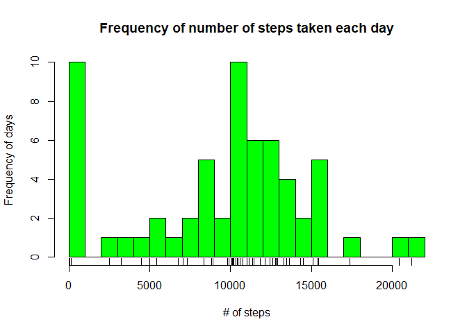
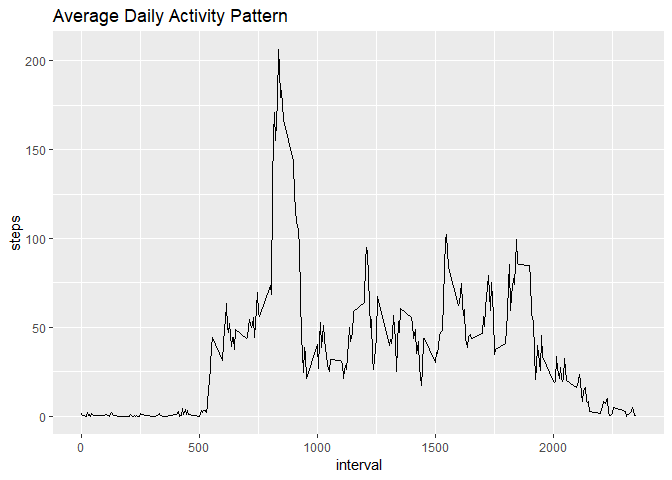
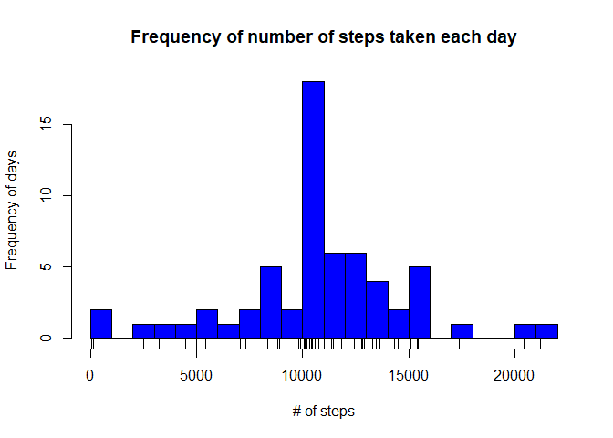
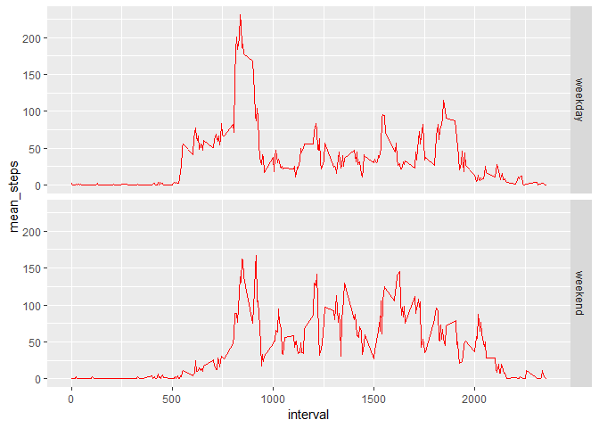

##Loading and Processing the data


```r
data <- read.csv("activity.csv")

data_com <- data
```

##What is mean total number of steps taken per day?


```r
Q1 <- tbl_df(data_com)
Q1 <- Q1 %>% group_by(date) %>% summarize_all(sum, na.rm=TRUE)

hist(Q1$steps, breaks = 20, col = "green", main = "Frequency of number of steps taken each day", xlab = "# of steps", ylab = "Frequency of days")

rug(Q1$steps)
```

<!-- -->

```r
mean_steps_Q1 <- as.integer(mean(Q1$steps, na.rm=TRUE))
median_steps_Q1 <- as.integer(median(Q1$steps, na.rm=TRUE))
```

The mean number steps taken per day = **9354** when missing values are removed.

The median number steps taken per day = **10395** when missing values are removed.

##What is the average daily activity pattern?

```r
Q2 <- tbl_df(data_com)
Q2 <- Q2 %>% group_by(interval) %>% summarize_all(mean, na.rm=TRUE)
ggplot(Q2, aes(interval, steps)) + geom_line() + labs(title = "Average Daily Activity Pattern")
```

<!-- -->

```r
Int_max <- Q2[which.max(Q2$steps),]$interval
```

The interval with the highest average steps is **835**

##Imputing missing values

```r
data_mv <- data
data_mv_NA <- nrow(data_mv[is.na(data_mv$steps),])
```

There are **2304** missing values for steps in the data set.


```r
data_mv <- data_mv %>% group_by(interval) %>% mutate(steps= ifelse(is.na(steps), mean(steps, na.rm=TRUE), as.integer(steps)))

Q3 <- data_mv %>% group_by(date) %>% summarize_all(sum)

hist(Q3$steps, breaks = 20, col = "blue", main = "Frequency of number of steps taken each day", xlab = "# of steps", ylab = "Frequency of days")

rug(Q3$steps)
```

<!-- -->

```r
mean_steps_Q3 <- as.integer(mean(Q3$steps))
median_steps_Q3 <- as.integer(median(Q3$steps))
```

The mean number steps taken per day = **10766** when missing values are imputed to the mean value for the given 5 minute interval.

The median number steps taken per day = **10766** when missing values are imputed to the mean value for the given 5 minute interval.

The impact of imputing the values of NAs to the average value for that time interval as opposed to excluding them is that the mean and median values are increased and are equal.

##Are there differences in activity patterns between weekdays and weekends?

```r
Q4 <- data_mv
Q4$date <- as.Date(Q4$date)
Q4$day_type <- ifelse(weekdays(Q4$date) %in% c("Saturday", "Sunday"), "weekend", "weekday")
Q4$day_type <- as.factor(Q4$day_type)

Q4 <- Q4 %>% group_by(day_type, interval) %>% summarize(mean_steps = mean(steps))
ggplot(Q4, aes(interval, mean_steps)) + geom_line(colour = "red") +facet_grid(day_type~.)
```

<!-- -->

The participant appears to be more consistently moving on weekend days.
